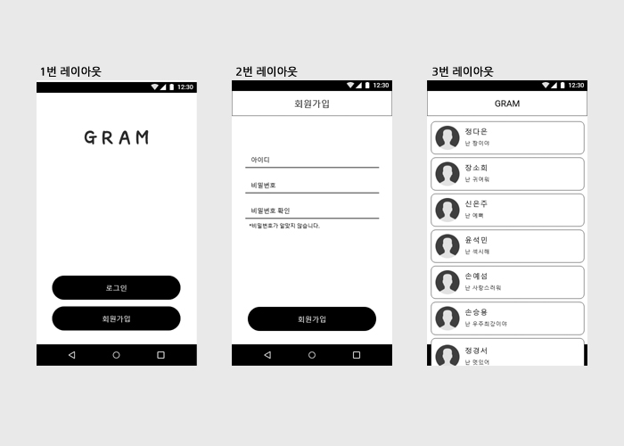

# recruit-test-2018-2
### GRAM 3.5기 신입생테스트 공지

#### 1차 : 네이버 폼 제출 & 과제 제출(7/6~8/15)

#### 2차 : 면접(8/20)

##### 모집대상 : 1학년

##### 모집분야 : 안드로이드, 안드로이드 & 디자인

##### 문의사항 : GRAM 페이스북 페이지 페메

- [네이버 폼 주소](http://naver.me/xi6NTbK1)
- [과제 제출 주소](https://github.com/DSM-GRAM/recruit-test-2018-2)
  - 안드로이드 : DSM-GRAM/recruit-test-2018-2/Android

  - 안드로이드&디자인 : DSM-GRAM/recruit-test-2018-2/AndroidDesign

    

#### 과제안내

- ##### 안드로이드 분야

  ##### 

  디자이너가 해당 디자인을 주었습니다.자유롭게 본인이 생각하는대로 어플리케이션을 구성해보세요.

  어플리케이션을 구성한 안드로이드프로젝트는 [여기](https://github.com/DSM-GRAM/recruit-test-2018-2/tree/master/Android )에 master로 commit 후 push해주세요.

  - 프로젝트명 : 학번  ex)20213

  

  디자이너에게 할 문의는 GRAM 페이스북 페이지 페메로 해주세요.

- ##### 안드로이드 & 디자인 분야

  

  기획자가 해당 와이어 프레임을 주었습니다. 자유롭게 본인이 생각하는대로 UI/UX를 구성해보세요. 본인이 구성한 UI/UX대로 어플리케이션도 구성해보세요.

  <조건>

  1. 색상 및 모양, 배경 등 자유롭게 디자인해주세요.
  2. 1번 레이아웃의 "회원가입"버튼을 클릭했을 경우 2번 레이아웃으로 이동합니다.
  3. 2번 레이아웃의 비밀번호, 비밀번호 확인이 일치할 경우 "비밀번호가 일치하지 않습니다" 텍스트가  "완료" 로 바뀝니다.
  4. 아이디, 비밀번호, 비밀번호 확인 중 하나라도 입력하지 않았을경우 "모두 입력해주세요." 라는 메시지를 띄워줍니다.
  5. 2번 레이아웃의 "회원가입"버튼을 클릭했을 경우 3번 레이아웃으로 이동합니다.
  6. 기획자에게 할 문의는 GRAM 페이스북 페이지 페메로 해주세요.

  

  UI/UX를 구성한 이미지파일은 [여기](https://github.com/DSM-GRAM/recruit-test-2018-2/tree/master/AndroidDesign)에 폴더를 만든후 그 폴더에 master로 commit 후 push해주세요.

  - 폴더명 : 학번  ex)20213
  - 이미지폴더명 : 학번Design  ex)20213Design
  - 이미지파일명 : 학번Design  ex)20213Design

  어플리케이션을 구성한 안드로이드 프로젝트는 해당 폴더에 master로 commit 후 push해주세요.

  - 프로젝트명 : 학번Android  ex)학번Android

  

  (폴더를 생성한 후 그 안에 안드로이드 프로젝트폴더와 디자인 이미지폴더를 만들어 그 안에 올려주세요.)

  

- ##### 1차 결과 발표

  8/17(금) 문자로 개별 통지

  

#### 면접일정

- 면접 날짜

  8/20(월)

- 면접 일정

  문자로 추후 개별 공지
